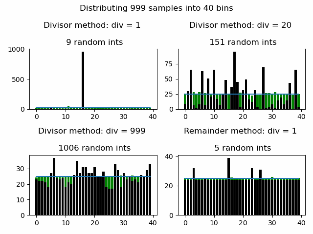
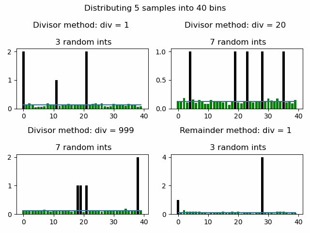
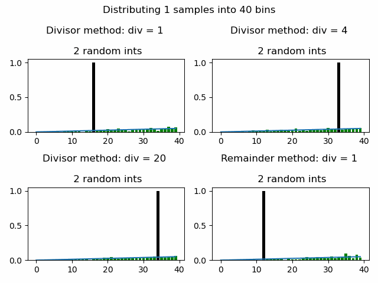

# Random sampling

The motivating idea is monte-carlo tree search, and specifically, kicking off batches of random searches efficiently. 

This scenario should arrive when multi-threading the tree search - it's not
especially efficient to spawn a new thread for every single search, and
synchronising all those threads would quickly become the bottleneck - hence, batching.

If we know we're going to complete 1000 random searches before we want to review the win/draw/loss statistics and decide where to search more thoroughly, it would be nice to not need
to generate 1000 random numbers, and instead distribute the moves in roughly the proportions we would expect to get had we done such a random distribution.

But how to distribute our searches efficiently?

## Divisor Method 

First, a random move is selected. Next, a random number, in the distribution uniform_range(1, (num_samples_remaining + 1) / divisor) is picked. The selected move is allocated this number, and the
num_samples_remaining is decreased by this number.

If the divisor is small, we expect to get a lot of clustering each time we do this - after all, 
the expected value for the first sample is num_samples / 2. 

If the divisor is large, we hopefully get something fairly evenly distributed for each sampling.

In the limit, calling our function many times, we should get out the uniform distribution we expect.

In python, this looks like:

```python
def divisor_method(num_samples, num_options, divisor):
    choices = np.zeros(num_options)

    remaining_samples = num_samples
    while remaining_samples > 0:
        # divvy up the remaining samples randomly
        allocated = random.randrange(remaining_samples + 1)
        # rescale the random result by the divisor - this effectively
        # reduces how much of the remaining samples can be allocated
        # at any one time
        allocated = (allocated + (divisor - 1)) // divisor
        # pick a random move, and give it the allocation
        choices[random.randrange(num_options)] += allocated
        remaining_samples -= allocated

    return choices
```

In the extreme case (divisor equal to the number of samples), we are doing 
the same amount of work as if for each sample, we'd randomly picked a move.

The interesting things to note are: 
- we *do* get back the uniform distribution we expected for all of the methods
- we see a lot of clustering with low divisors
- even in the n/20 case, we're still seeing a pretty spikey distribution,
  and yet also doing >10% as much work as if we just randomly sampled each 
  move.

Here's an animation showing a number of divisors, the number of random numbers generated for each method,
and the instantaneous (black) vs cumulative (green) distributions for each bin.

> A note on plots:

    - black is the instantaneous distribution (the result of calling the function once.)
    - green is the average distribution from all calls made so far
    - the blue line is the "true" distribution from which the choices are being sampled


It's possible that clustering in each instantaneous sample is good for us - more clustering means more samples
per thread and theoretically fewer threads. 

However, it also puts more of our eggs into fewer baskets. Clustering on a bad tree might mean we spend a lot of effort exploring a part of the space we really don't 
care about.

## Remainder Method


An alternative would be to evenly apportion all our samples between moves, and only divvy up the remainder randomly. If we have
more moves than samples, we get back our divisor method. If we have many more samples than moves, we should essentially have a uniform distribution of samples.

In python,

```python
def remainder_method(num_samples, num_options, divisor):
    # fairly distribute a whole number of samples between moves
    fair_dist_per_option = num_samples // num_options
    choices = [fair_dist_per_option for i in range(num_options)]
    # now, divide the remainder randomly
    remainder = num_samples % num_options
    while remainder > 0:
        allocated = ((random.randrange(remainder + 1) 
                    + (divisor - 1)) // divisor)
        # pick a random move
        choices[random.randrange(num_options)] += allocated
        remainder -= allocated

    return choices
```

Let's see how that looks (using 999 samples so we don't get a perfectly even split into our 40 moves) 

(the remainder method is in the bottom right plot):




If we have relatively few samples, we get a much more even distribution with the remainder method compared to the divisor method:


And in the case where num_options > num_samples, we just get back the divisor method:


# Biasing Samples
Of course, once we have some prior knowledge of the probability that each move leads to a favorable outcome 
(i.e. we've run the tree search a few times before,) we want to bias our sampling based on some arbitrary array of 
search densities.

Since the remainder method also makes use of the divisor method, we'll tackle that first.

One way to go about it would be to modify the *choose a move* part of the divisor method (where
once we've generated a random value, we pick which move to assign it to.) 

At the point where we pick this random move, we could try bias the random choice towards those bins
we think are more valuable.

We can do this, in python at least, using the `random.choices()` function, which lets us specify some weights.

```python
def biased_divisor(num_samples, num_options, divisor, bias, choice_list):
    ...
        # the only change - pass in the array of weights
        choices[random.choices(range(num_options), weights=bias)] += allocated
        remaining_samples -= allocated
        
    return choices
```

For the remainder method, the easiest thing to do is to multiply the base distribution by
the weights, recalculate the remainder (if we're dealing with integers, we need to make sure not to undercount
the number of samples,) and then call the divisor method on what's left.

In python, the full code for the biased remainder/divisor method is now:

```python
def divvy_remainder_biased(num_samples, num_options, divisor, bias, choice_list):
    choices = num_samples * bias // sum(bias) # integer division to keep things whole

    remainder = num_samples - sum(choices)

    # now, divide the remainder randomly
    n_calls = 0
    while remainder > 0:
        n_calls += 1

        allocated = (random.randrange(remainder + 1) + (divisor - 1)) // divisor
        choices[random.choices(range(num_options), weights=bias)[0]] += allocated
        remainder -= allocated

    return choices
```

Making these changes, and specifying a triangular distribution, we get these outputs:


Finally, in the case where we only have 1 sample left (which will be quite a lot of our tree search,) it doesn't 
really make sense to pick a bin, and only then choose how much to allocate. If we look at the results for 1 sample,
all of our methods developed so far produce the right results, but on average require 2 runs through the algorithm
before allocating the sample. 



This is because with our random pick between (0, 1), we have an expected value of (0 + 1) / 2 = 0.5. I.e. we only
get to allocate our sample 50% of the time. We can easily fix this by always allocating at least 1 sample. Lets do that,
and see how it affects the distribution:


The new distribution, at least to my eye, is effectively
identical to the old one. There should be a slight
difference in the exact distribution to before, since
previously, the biases were essentially applied twice per pass. I'd expect the new min(1) sampling to more faithfully
reproduce the expected distribution.

Looking at the results, however, they're essentially indistinguishable:

#### Without min1:


#### With min(1) - you can tell by the reduced computation cost (1 integer rather than 2 per sample)


## Uh...

Seems done and dusted, right?

Well, if num_samples is a very large number, we pretty faithfully reproduce our distribution. Also, if num_samples is very low,
we also faithfully reproduce the distribution. But what if our number of samples is close to the number of options?


... gross. 

There's a clear step where we go from one integer sample per move to 2 samples per move. This
gives us the best instantaneous distribution we could hope for, but effectively compresses our distribution to integer values and makes our distribution very blocky.

There's still some hope though - for these cases, our remainders are going to be very large.

Taking our inspiration from [MMP government](https://en.wikipedia.org/wiki/Mixed-member_proportional_representation), we can strategically distribute this remainder. In other words, the distribution we want for the random samples could be biased to smooth out these integer steps.

Something like this: 

Turns out this function is just the remainder of our biased samples, before we normalize them; that is,

```python
choices = num_samples * bias // sum(bias)

remainder_bias = (num_samples * bias) % sum(bias)

remainder = num_samples - sum(choices)
```

Giving the full function:

```python
def mmp(num_samples, num_options, divisor, bias):
    choices = num_samples * bias // sum(bias)

    # smooth the edges from our integer division
    remainder_bias = (num_samples * bias) % sum(bias)

    remainder = num_samples - sum(choices)

    # now, divide the remainder (biased)-randomly
    n_calls = 0
    while remainder > 0:
        n_calls += 1

        allocated = (random.randrange(1, remainder + 1) + (divisor - 1)) // divisor
        choices[random.choices(range(num_options), 
        # our weights are now the remainder bias
        weights=remainder_bias)[0]] += allocated
        remainder -= allocated

    return choices
```

The proof is in the pudding, so lets see what it looks like:

