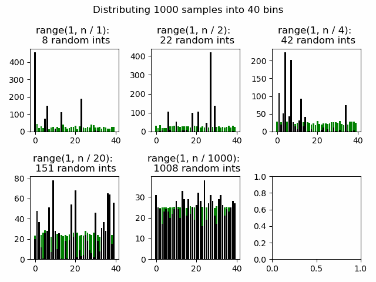
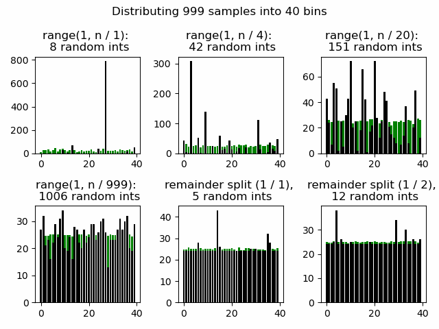
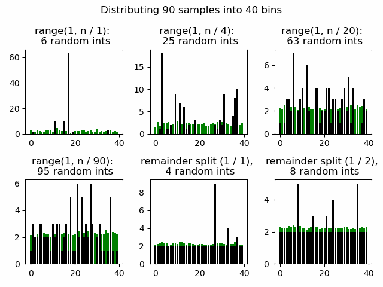
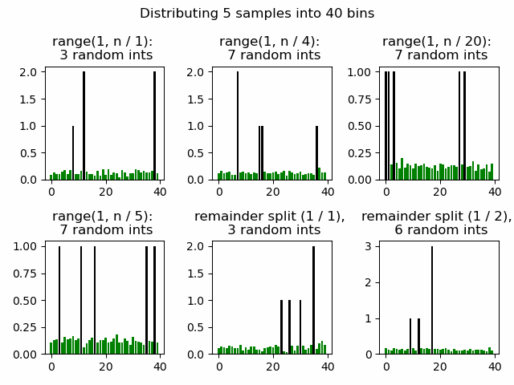

# Random sampling

The idea is to try and multi-thread the monte-carlo tree search. With the move selection purely
random, we would expect some amount of clustering - e.g. if there are 1000 searches and 10 move choices,
we expect each move to be picked ~100 times. 

If we have 1000 searches, it would be nice to not have 
to generate 1000 random numbers, and instead distribute the moves in roughly the proportions we would expect to get had we done such a random distribution. An approach doing exactly that is shown below. 

## Divisor Method 

First, a random move is selected. Next, a random number, in the distribution uniform_range(1, (num_samples_remaining + 1) / divisor) is picked. The selected move is allocated this number, and the
num_samples_remaining is decreased by this number.

If the divisor is small, we expect to get a lot of clustering each time we do this - after all, 
the expected value for the first sample is num_samples / 2. 

If the divisor is large, we hopefully get something fairly evenly distributed for each sampling.

In the limit, calling our function many times, we should get out the uniform distribution we expect.

In python, this looks like:

```python
def divisor_method(num_samples, num_options, divisor):
    choices = np.zeros(num_options)

    remaining_samples = num_samples
    while remaining_samples > 0:
        # divvy up the remaining samples randomly
        allocated = random.randrange(remaining_samples + 1)
        # rescale the random result by the divisor - this effectively
        # reduces how much of the remaining samples can be allocated
        # at any one time
        allocated = (allocated + (divisor - 1)) // divisor
        # pick a random move, and give it the allocation
        choices[random.randrange(num_options)] += allocated
        remaining_samples -= allocated

    return choices
```

Here's an animation showing a number of divisors, the number of random numbers generated for each method,
and the instantaneous (black) vs cumulative (green) distributions for each bin.

In the extreme case (divisor equal to the number of samples), we are doing 
the same amount of work as if for each sample, we'd randomly picked a move.

The interesting things to note are: 
- we *do* get back the uniform distribution we expected for all of the methods
- we see a lot of clustering with low divisors
- even in the n/20 case, we're still seeing a pretty spikey distribution,
  and yet also doing >10% as much work as if we just randomly sampled each 
  move.



It's possible that clustering in each instantaneous sample is good for us - more clustering means more samples
per thread and theoretically fewer threads. 

However, it also puts more of our eggs into fewer baskets. Clustering on a bad tree might mean we spend a lot of effort exploring a part of the space we really don't 
care about.

## Remainder Method


An alternative would be to evenly apportion all our samples between moves, and only divvy up the remainder randomly. If we have
more moves than samples, we get back our divisor method. If we have many more samples than moves, we should essentially have a uniform distribution of samples.

In python,

```python
def remainder_method(num_samples, num_options, divisor):
    # fairly distribute a whole number of samples between moves
    fair_dist_per_option = num_samples // num_options
    choices = [fair_dist_per_option for i in range(num_options)]
    # now, divide the remainder randomly
    remainder = num_samples % num_options
    while remainder > 0:
        allocated = ((random.randrange(remainder + 1) 
                    + (divisor - 1)) // divisor)
        # pick a random move
        choices[random.randrange(num_options)] += allocated
        remainder -= allocated

    return choices
```

Let's see how that looks (using 999 samples so we don't get a perfectly even split into our 40 moves):




If we have relatively few samples, we get a much more even distribution with the remainder method compared to the divisor method:



And in the extreme case, we just get back the divisor method:


# Biasing Samples
Of course, once we have some prior knowledge of the probability that each move leads to a favorable outcome 
(i.e. we've run the tree search a few times before,) we want to bias our sampling based on some arbitrary array of 
search densities.

Since the remainder method also makes use of the divisor method, we'll tackle that first.

One way to go about it would be to modify the *choose a move* part of the divisor method (where
once we've generated a random value, we pick which move to assign it to.) 

At the point where we pick this random move, we could try bias the random choice towards those bins
we think are more valuable.